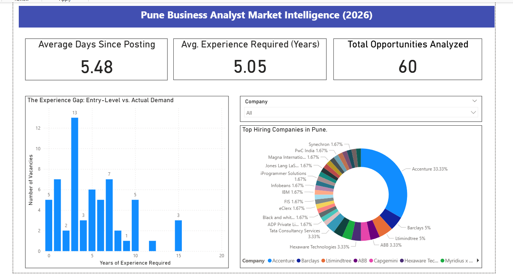

# Market Intelligence: Why "Entry-Level" Business Analyst Roles are a Myth
**A Data-Driven Analysis of the Pune Job Market (March 2026)**

## 📌 The Problem
As a final-year BBA (CA) student at Abeda Inamdar Senior College, I noticed that most "Entry-Level" Business Analyst roles on portals like Naukri still felt out of reach. I decided to stop guessing and start measuring: **Does the market actually hire freshers, or is "Entry-Level" just a label?**

## 🛠️ The Tech Stack
- **Data Extraction:** Python (Selenium) to scrape 100+ live job postings from Pune.
- **Data Engineering:** Python (Pandas) to clean and transform text strings into numeric values for analysis.
- **Data Analysis:** SQL (SQLite) to identify market concentration and experience gaps.
- **Visualization:** Power BI to create an executive-level dashboard.

## 📊 Key Findings (The Case Study)
1. **The Experience Paradox:** My analysis found that the **average "minimum" experience required for BA roles is 5.2 years**, despite many being tagged as entry-level.
2. **The 8% Reality:** Only a small fraction of the total roles analyzed were truly "Fresher-Friendly" (0 years required).
3. **Market Dominance:** A cluster of MNCs (led by Accenture and Barclays) accounts for the majority of active hiring in the Pune region.

## 🖼️ Dashboard Preview

## 📈 Strategic Recommendation
The data proves that the ATS (Applicant Tracking System) is a major hurdle for freshers due to "Experience Inflation." My recommendation for students is to pivot from **Quantity (Cold Apps)** to **Quality (Referrals)**, focusing on the top hiring companies identified in this study.

---

## 📬 Contact & Connect
Let's connect! I am always open to discussing data, business analysis, and market trends.

## ⚖️ License & Copyright
© 2026 Tanushree Avinash Angirwal  
This project is licensed under the **MIT License**. You are free to use, modify, and distribute this code, provided that the original copyright notice and permission notice are included in all copies.
